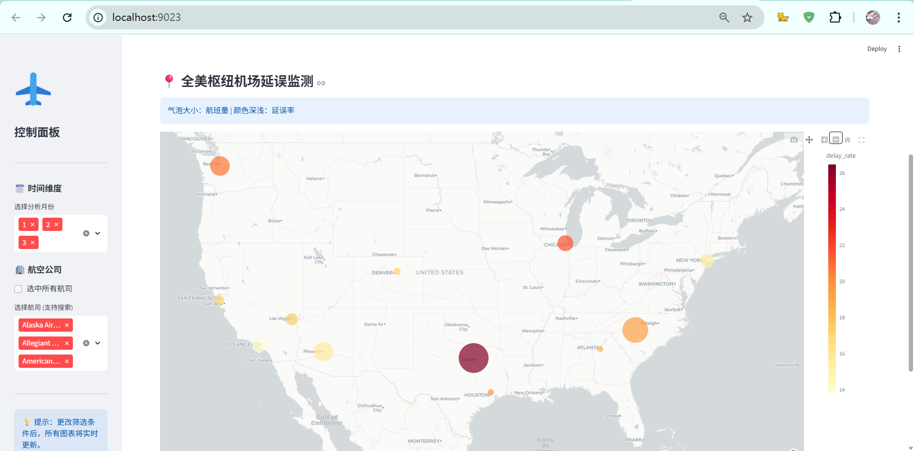
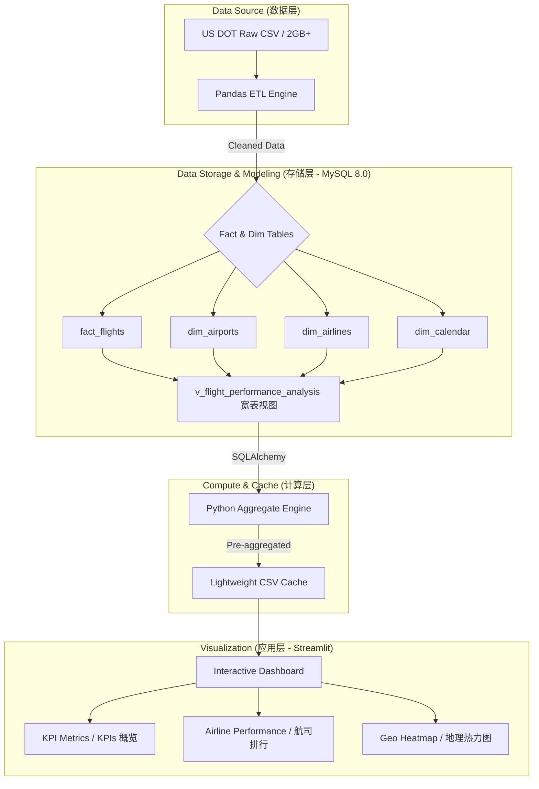

# 2025 Q1 美国航班运营大数据分析与可视化平台

## 项目简介

本项目针对 2025 年第一季度（1月-3月）全美民航约 160万条 航班真实运行数据进行深度分析。通过构建经典的 星型模型（Star Schema） 数据库架构，并利用 Python 进行高效的 ETL 数据清洗与预处理，最终实现了一个支持多维度下钻、交互式地理热力图的 BI 可视化大屏。

## 界面预览
仪表板: 仪表盘主界面

数据分析：包含航司排名及延误归因饼图。

地理分布: 气泡大小代表机场流量，颜色深浅（Red）代表延误率。


## 核心亮点

大数据处理能力：采用 Chunking 分块处理机制，成功处理 2GB+ 原始 CSV 文件，有效解决内存溢出问题。

星型建模架构：将原始事实表拆分为机场、航司、日历维度表，显著提升查询效率。

实时交互分析：支持按航司、月份动态筛选，地理空间分布图（Mapbox）与运营 KPI 指标实时联动。

深度归因分析：对延误因子（航司、天气、空管、晚到）进行量化拆解。

## 系统架构图 (System Architecture)

本项目遵循标准的大数据分析工作流，通过解耦数据存储、逻辑计算与前端呈现，确保了系统的高效性与可扩展性。


## 技术架构

数据层: 美国交通部 (US DOT) 2025 Q1 原始航班数据。

ETL 层: Python (Pandas + SQLAlchemy) 进行数据清洗、异常处理及特征工程。

存储层: MySQL 8.0 数据库，构建星型模型并建立预聚合视图提升查询速度。

展示层: Streamlit 框架 + Plotly 交互式绘图引擎。

## 文件结构
```
flight-ops-analysis/
├── sql/
│   ├── modeling.sql                # 数据库核心建模脚本（事实表与维度表设计）
│   └── create_analysis_view.sql    # 预聚合宽表视图创建脚本（含 Collation 修复）
├── src/
│   ├── data_preprocessing.py       # ETL 脚本：负责 2GB+ CSV 的分块读取与数据入库
│   ├── aggregate_data.py           # 聚合引擎：从视图抽取数据并生成轻量化本地缓存
│   └── app.py                      # 前端看板：基于 Streamlit 的交互式 Web 应用
├── data/                           # 数据存放目录（Git 忽略大文件）
│   ├── airline_monthly_performance.csv # 航司运营维度缓存数据
│   └── airport_performance.csv         # 机场地理维度缓存数据
├── requirements.txt                # 项目依赖清单
└── README.md                       # 项目说明文档
```

## 模块说明

### 1.数据预处理 (src/data_preprocessing.py)

字段精简：从原始数百个字段中提取核心运营指标（延误时长、取消标志等）。

特征工程：增加 Is_Weekend、Is_Holiday 等分析维度。

高效存储：利用 to_sql 结合 multi 模式实现万级/秒的数据入库。

### 2.数据库建模 (sql/modeling.sql)

事实表: fact_flights (存储起降、时长、延误明细)。

维度表: dim_airports (机场与地理信息), dim_airlines (航司信息), dim_calendar (时间粒度)。

分析视图: v_flight_performance_analysis 预先 Join 维度字段，供前端秒级调用。

### 3.数据聚合引擎 (src/aggregate_data.py)

针对百万级数据进行预聚合，生成轻量化 CSV 缓存文件。

支持地理空间聚合，保留坐标信息以驱动热力图。

### 4.交互式大屏 (src/app.py)

KPI 看板: 监测航班总量、平均准点率、延误数、取消数。

运营分布: 航司延误时长横向对比。

空间热力图: 基于 Mapbox 的全美机场流量与延误率分布，支持实时筛选。

## 快速开始

### 安装依赖
```commandline
pip install -r requirements.txt
```

### 运行步骤

数据库初始化: 在 MySQL 中运行datamodeling.sql

数据导入: 运行预处理脚本将原始 CSV 导入数据库。

生成缓存:

python src/aggregate_flight_data.py


启动看板:

streamlit run src/app.py


